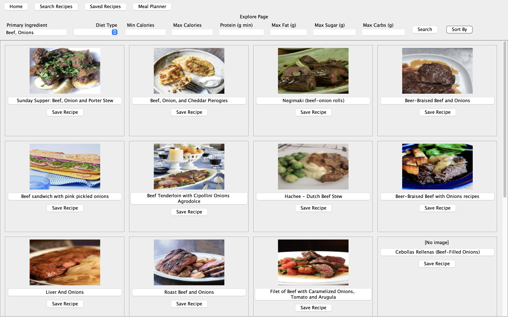
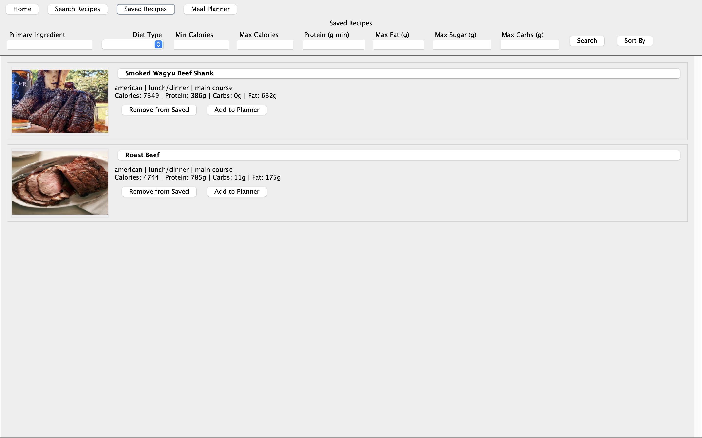
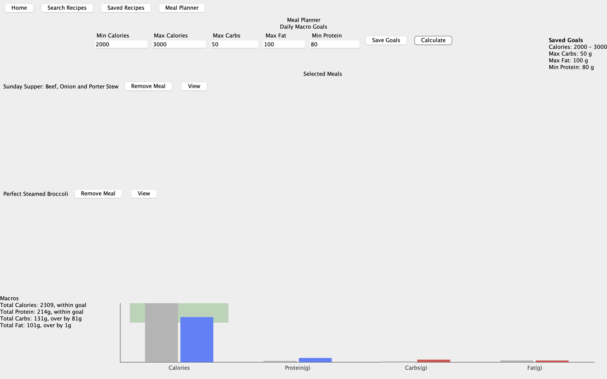
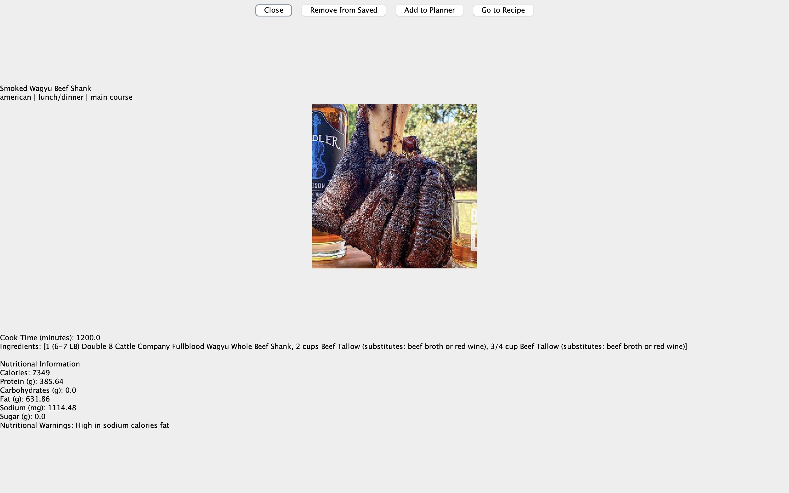
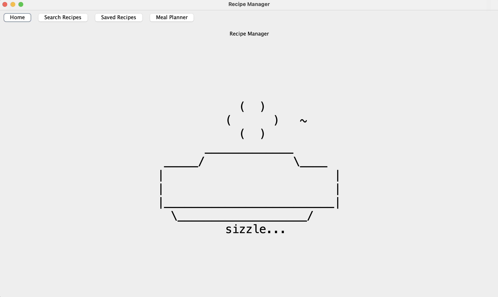

# Recipe Manager

**Authors:** Rocky Tu, Chris Zheng, Huzaifah Naseem, Owen Lo

---

## Table of Contents
- [Overview](#overview)
- [Features](#features)
- [Installation](#installation)
- [Usage Guide](#usage-guide)
- [Technical Overview](#technical-overview)
- [License](#license)
- [Feedback](#feedback)
- [Contributing](#contributing)

---

## Overview

**Recipe Manager** is a Java Swing desktop application for finding, saving, and planning meals with custom nutrition goals.

The app integrates with the **Edamam Recipe API** to search for recipes based on ingredients, diets, and macro targets. Users can save their favorite recipes locally, plan meals for the day, and compare their total nutrient intake against their goals using a visual chart.

**Why this project exists:**
We wanted a single-window meal planning tool that:
- Searches recipes from a trusted source (Edamam)
- Tracks nutritional macros
- Plans multiple meals with visual feedback
- Saves and reloads favorites locally for offline review

---

## Features

### Explore Recipes
- Search by ingredient(s), diet, calories, and macro limits.
- Comma-separated multi-ingredient matching (must match all).
- Sort results by:
    - Similar to favourites
    - Least ingredients
    - Least prep time
    - Least/most calories
    - Most protein
    - Least fat
    - Least sugar
- Async image loading for responsive UI.



---

### Saved Recipes
- View all locally saved recipes (persisted to `favourites.txt`).
- Filter saved recipes by the same criteria as Explore.
- Remove from saved list with one click.
- Add saved recipes directly to the Meal Planner.



---

### Meal Planner
- Add/remove recipes from the daily plan.
- Set **min/max daily calorie**, **max carbs**, **max fat**, **min protein** goals.
- Save goals for persistent reference.
- Calculate current totals and see if you’re **within goal**, **over**, or **under**.
- Visual chart shows:
    - Actual vs goal macros
    - Min–max calorie range band
    - Red/blue bars for pass/fail status.



---

### Single Recipe View
- View detailed nutrition, ingredients, and dish types.
- Add/remove from favourites or planner.
- Go directly to the recipe’s source link.



---

## Installation

### Prerequisites
- **Java 17** or newer
- Internet connection (for API calls)
- An [Edamam Recipe Search API key](https://developer.edamam.com/edamam-recipe-api)

### Steps
1. Clone the repository:
   ```bash
   git clone https://github.com/chris112255/csc207project.git
   cd recipe-manager

2. Add your Edamam API credentials:
  - Open `api/EdamamRecipeSearchGateway.java`
  - Replace `APP_ID` and `APP_KEY` with your own:
    ```java
    private static final String APP_ID = "your_app_id";
    private static final String APP_KEY = "your_app_key";
    ```

3. Compile and run:
   ```bash
   javac -d out $(find src -name "*.java")
   java -cp out main.view.ViewManager
 
Note: For easier builds, you can use IntelliJ IDEA or Eclipse—just import the src folder as a project.

---

## Usage Guide

## Usage Guide

1. **Home (Boiling Pot)**
   After cloning the repo and adding your Edamam API keys, run the app to land on the **Home** page with a boiling‑pot ASCII animation.  
   _Screenshot:_  
   

2. **Explore Recipes**
  - Go to **Search Recipes**.
  - Filter by ingredient(s), diet, calories, and macro limits; click **Search**.
  - Click a card’s **Save Recipe** to store it locally (written to `favourites.txt`).  
    _Screenshot:_  
    

3. **Saved Recipes**
  - Open **Saved Recipes** to see everything you’ve saved.
  - You can filter/sort, remove items, or add them directly to the **Meal Planner**.  
    _Screenshot:_  
    

4. **Single Recipe View**
  - Click any recipe title to open the **Single Recipe** window.
  - From here you can:
    - **Add to Planner** (or remove) to include it in your daily plan.
    - **Go to Recipe** to open the source website with full cooking instructions.  
      _Screenshot:_  
      

5. **Meal Planner & Goals**
  - Open **Meal Planner** to review the recipes you’ve added.
  - Define your nutritional goals:
    - **Min/Max Calories**, **Max Carbs**, **Max Fat**, **Min Protein**.
  - Click **Save Goals** to persist them for the session.
  - Click **Calculate** to compare your current plan vs. goals:
    - See totals and pass/over/under status.
    - View a chart with your **actual vs. goal** macros and a calorie band.  
      _Screenshot:_  
      

---

## Technical Overview

### Architecture

The project follows a **Clean Architecture** structure:

- **Entities**
  - `Recipe` — core domain model with ingredients, nutrients, and warnings.
  - `Nutrients` — encapsulates macro/micro values.
  - `RecipeBuilder` — converts Edamam JSON → `Recipe`.

- **Use Cases**
  - `SearchRecipesUseCase` — coordinates recipe search via gateway.
  - `FavouritesUsecase` — local persistence for saved recipes.
  - `MealPlannerUsecase` — manages selected meals, goals, and macro evaluation.

- **Interface Adapters**
  - `RecipeSearchGateway` — interface for search backends.
  - `EdamamRecipeSearchGateway` — Edamam API implementation.

- **UI**
  - Swing views: `ExplorePageView`, `SavedRecipesView`, `MealPlannerView`, `SingleRecipeView`, `HomePageView`.
  - `ViewManager` — controls navigation and state persistence.

---

### Data Flow
1. UI gathers filters → passes to `SearchRecipesUseCase`.
2. Use case calls `EdamamRecipeSearchGateway`.
3. API JSON is parsed by `RecipeBuilder`.
4. Recipes are returned to the view for display.

---

## License

This project is licensed under the **MIT License** — see the [LICENSE](LICENSE) file for details.

---

## Feedback

We welcome suggestions and bug reports!

- Open an [issue on GitHub](https://github.com/yourusername/recipe-manager/issues)
- Or email: `rocky.tu@mail.utoronto.ca`

Please include:
- Steps to reproduce (if it’s a bug)
- Screenshot or console output
- Expected vs actual behavior

---

## Contributing

We’re happy to review pull requests.

1. **Fork** the repository
2. Create a **feature branch**:
```bash
git checkout -b feature/my-feature


   

